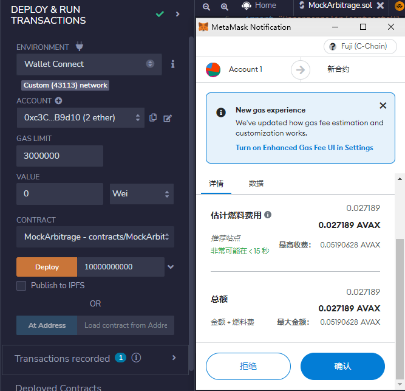
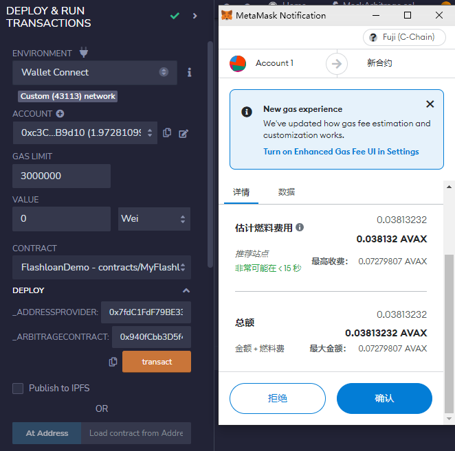
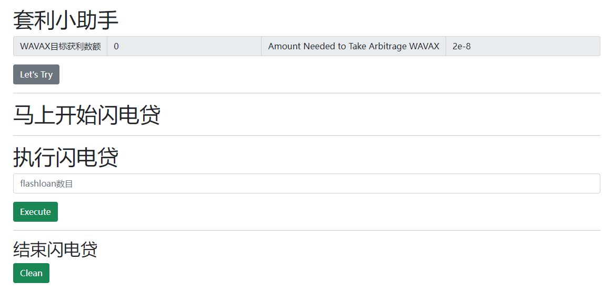

### 合约端步骤

IDE:  [Remix](https://remix.ethereum.org/)

获取部署网络的测试币: [雪崩网络测试网水龙头](https://faucet.avax-test.network/)

#### 套利合约

compile MockArbitrage.sol with compiler 0.6.6

##### 部署设定

- ENVIRONMENT : 雪崩网络富士测试网（Avalanche Fuji Faucet）
- CONTRACT : MockArbitrage
- Deploy : requiredFunds^10 ~ requiredFunds^18 (这里要换成整数形式需要做乘法)



- 在[雪崩网络观察网](https://testnet.snowtrace.io/tx/0xf20efedbdb6d6ecaa315ff88c2a24493815e67e23aa01bf55c0a2fb0247247ba)中检查部署是否完成

- 部署成功后: 获得套利合约的部署地址 : 0x940fCbb3D5f4f34816A006B5D80D899Fde8523a8


#### 闪电贷合约

##### 部署设定

- ENVIRONMENT : 雪崩网络富士测试网（Avalanche Fuji Faucet）
- CONTRACT : FlashloanDemo
- Deploy : 
  - _ADDRESSPROVIDER : 0x7fdC1FdF79BE3309bf82f4abdAD9f111A6590C0f
  - _ARBITRAGECONTRACT : 0x940fCbb3D5f4f34816A006B5D80D899Fde8523a8



- 在[雪崩网络观察网](https://testnet.snowtrace.io/tx/0x5ad69c18ae539e9c09ee950dd1265d22a6a20a3d3ba515bab0fd9d86cff1cac6)中检查部署是否完成
- 获得闪电贷合约部署地址 : 0x4eEDdE6e9B8C1a26523c012501ef3B1c48aEcb5F


### 前端步骤

#### 设定合约地址

```javascript
const arbitrageToken = "0xd00ae08403B9bbb9124bB305C09058E32C39A48c";
const flashoanContractAddress = "0x4eEDdE6e9B8C1a26523c012501ef3B1c48aEcb5F";
const mockArbitrageAddress = "0x940fCbb3D5f4f34816A006B5D80D899Fde8523a8";
```

部署前端页面

```bash
python -m http.server --bind 172.28.176.1
```

部署成功会在浏览器显示:

